# More Benchmark Results 

The results for using 32-bit unsigned integers as keys.

## false positive rate

+ desired fpr = 0.01%
        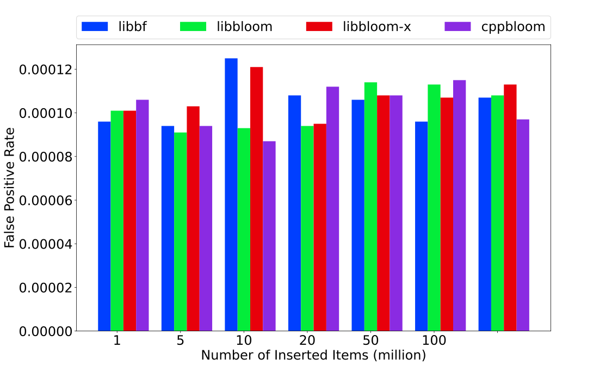
+ desired fpr = 0.1%
        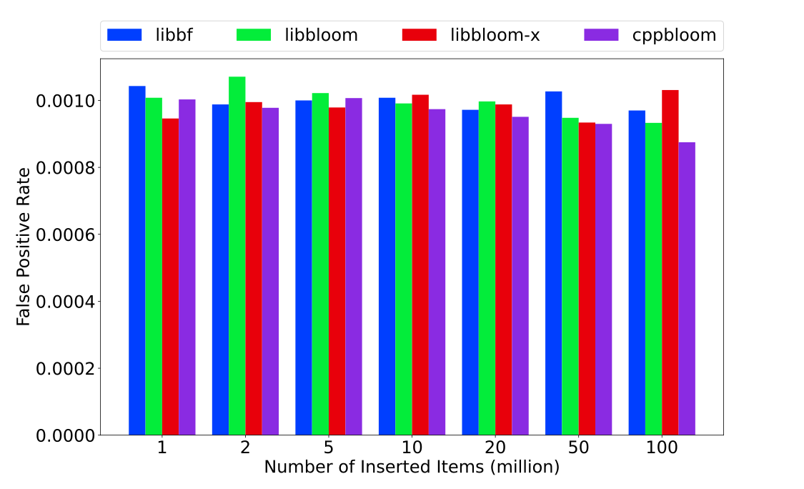
+ desired fpr = 1%
        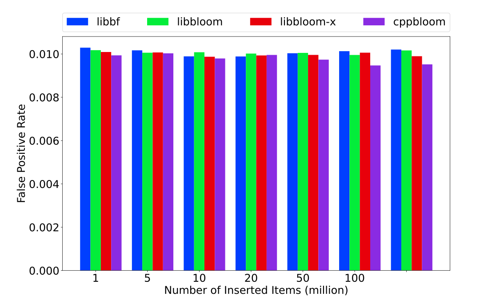
+ desired fpr = 10%
        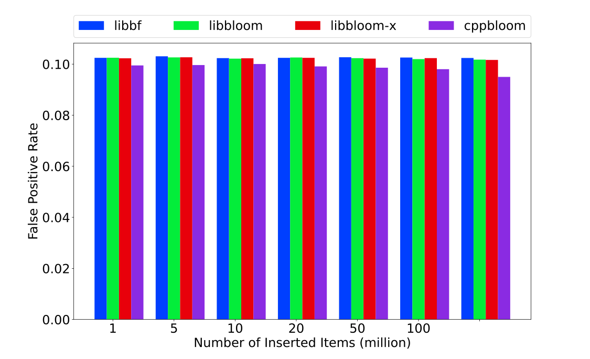

## construction speed

+ 1 millions (items inserted during construction)
        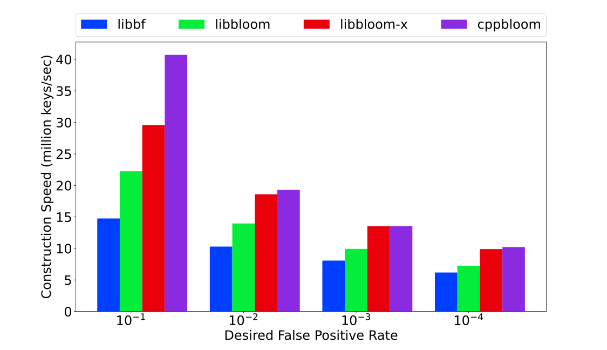
+ 2 millions (items inserted during construction)
        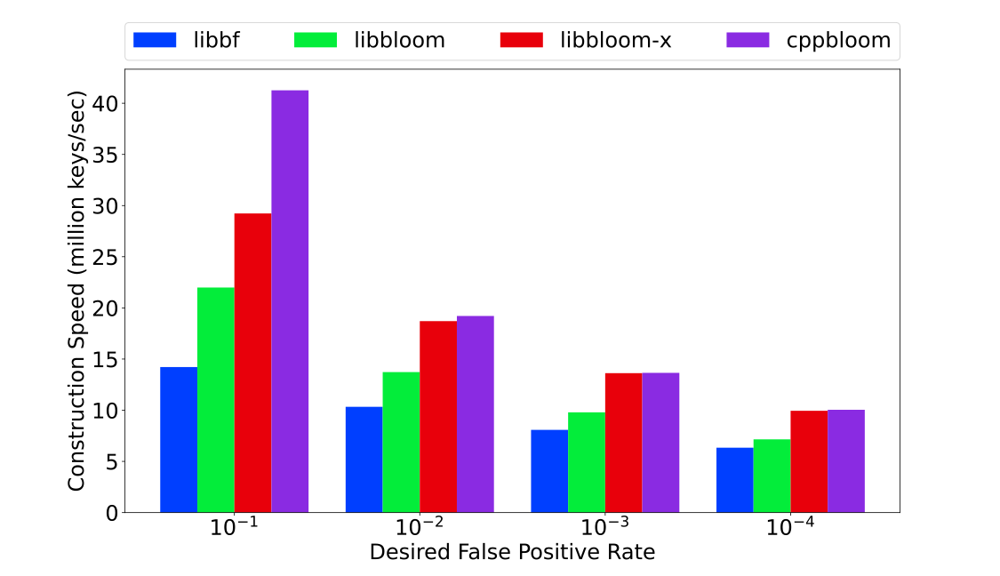
+ 5 millions (items inserted during construction)
        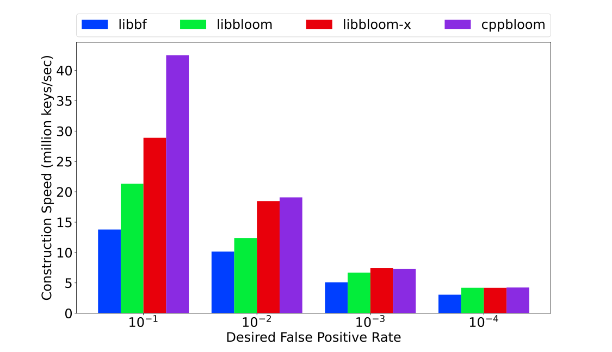
+ 10 millions (items inserted during construction)
        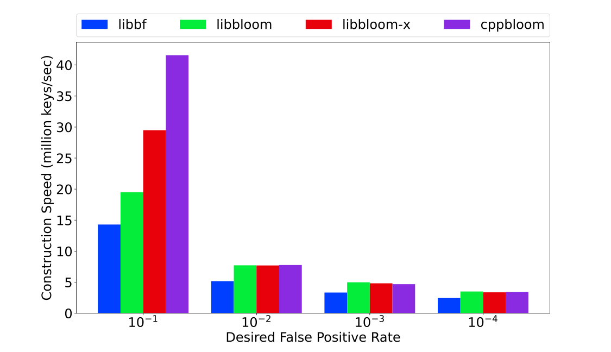
+ 20 millions (items inserted during construction)
        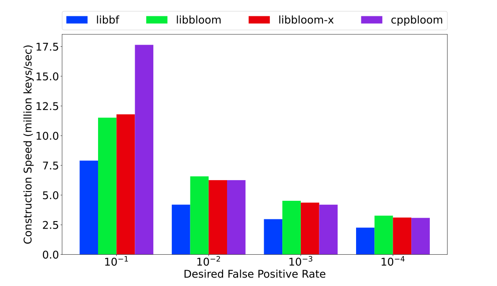
+ 50 millions (items inserted during construction)
        
+ 100 millions (items inserted during construction)
        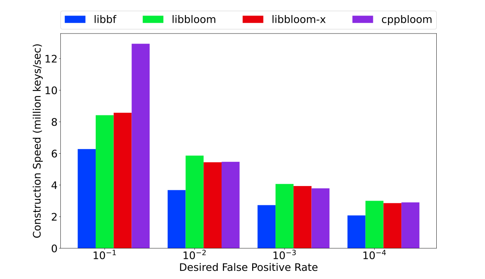

## check speed

+ 1 millions (items inserted during construction)
        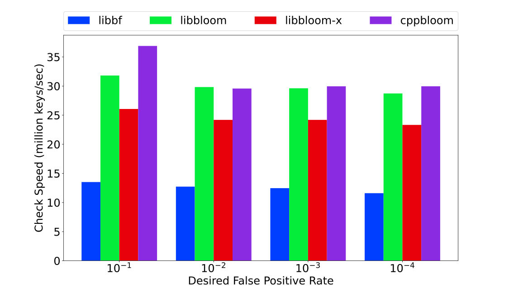
+ 2 millions (items inserted during construction)
        
+ 5 millions (items inserted during construction)
        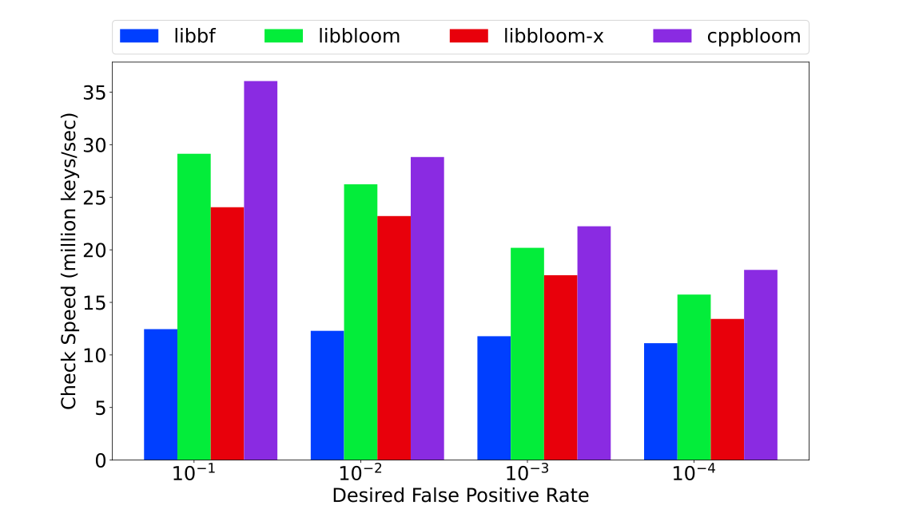
+ 10 millions (items inserted during construction)
        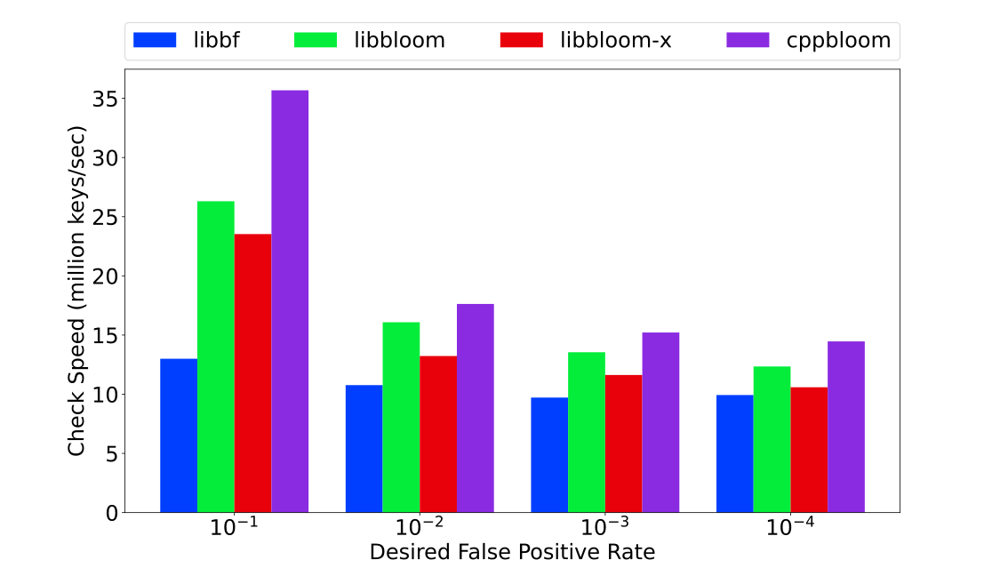
+ 20 millions (items inserted during construction)
        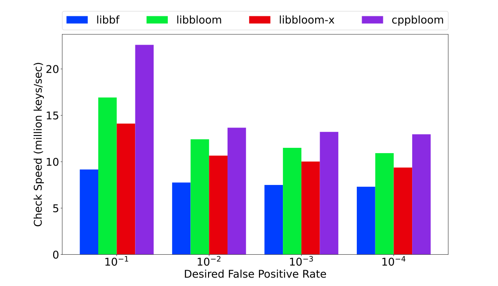
+ 50 millions (items inserted during construction)
        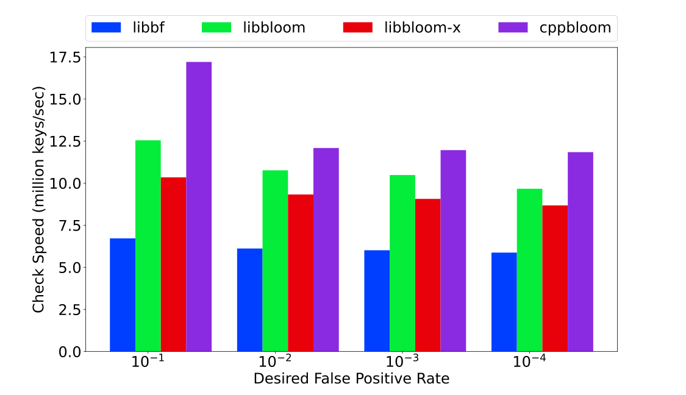
+ 100 millions (items inserted during construction)
        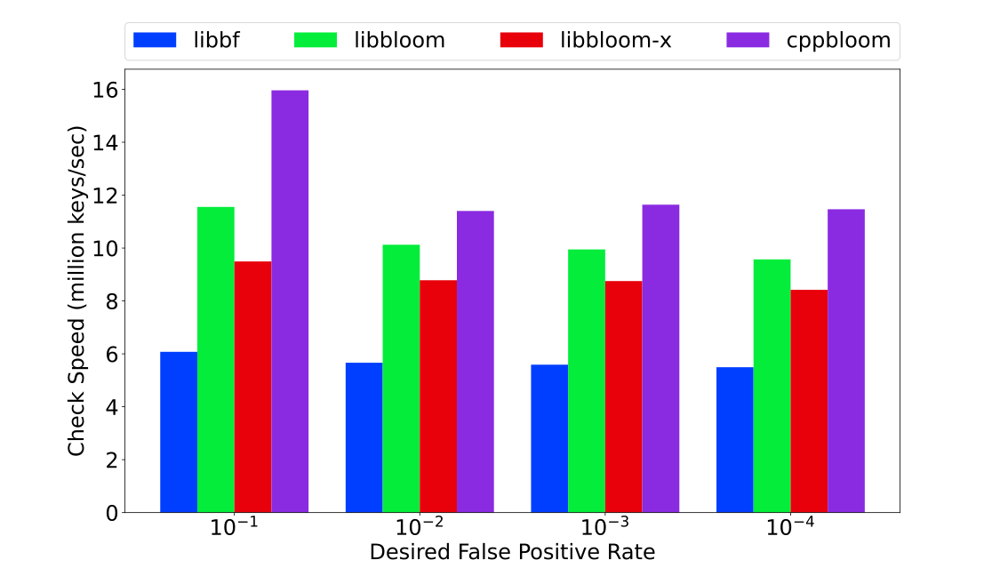

## space

+ 1 millions (items inserted during construction)
        
+ 2 millions (items inserted during construction)
        
+ 5 millions (items inserted during construction)
        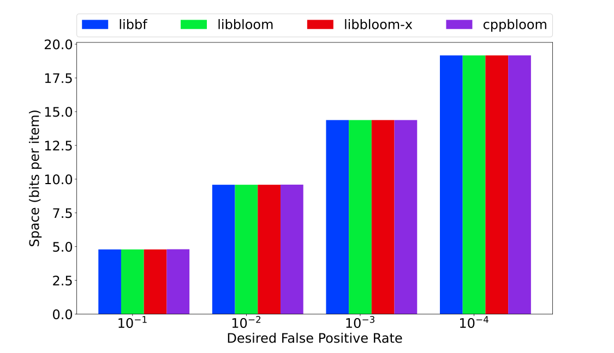
+ 10 millions (items inserted during construction)
        
+ 20 millions (items inserted during construction)
        
+ 50 millions (items inserted during construction)
        
+ 100 millions (items inserted during construction)
        