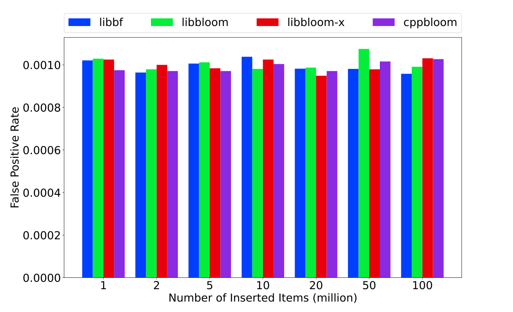

# Benchmark Results

Here, we only present the results for using 64-bit unsigned integers as keys, the results for using 32-bit unsigned integers as keys lead to the same conclusion, which can be find in [32u.md](./32u.md).

## Benchmarked

+ [cppbloom](https://github.com/ArashPartow/bloom): C++ Bloom Filter Library 
+ [libbloom](https://github.com/jvirkki/libbloom): A simple and small bloom filter implementation in plain C
+ [libbloom-x](https://github.com/long-gong/libbloom-x): C++/Python wrapper for libbloom (with some modificatons)
+ [libbf](https://github.com/mavam/libbf): Bloom filters for C++11

All algorithms are compiled with `gcc/g++ 7.5.0` with `-O3` on an Intel(R) Core(TM) i7-7700 CPU @ 3.60GHz running Ubuntu 18.04.

## Overall Preferences

cppbloom > libbloom (libbloom-x) > libbf

## False Positive Rate

+ desired fpr = 0.01%
        
+ desired fpr = 0.1%
        
+ desired fpr = 1%
        
+ desired fpr = 10%
        

## Construction Speed

+ 1 millions (items inserted during construction)
        
+ 2 millions (items inserted during construction)
        
+ 5 millions (items inserted during construction)
        
+ 10 millions (items inserted during construction)
        
+ 20 millions (items inserted during construction)
        
+ 50 millions (items inserted during construction)
        
+ 100 millions (items inserted during construction)
        

## Check Speed

+ 1 millions (items inserted during construction)
        
+ 2 millions (items inserted during construction)
        
+ 5 millions (items inserted during construction)
        
+ 10 millions (items inserted during construction)
        
+ 20 millions (items inserted during construction)
        
+ 50 millions (items inserted during construction)
        
+ 100 millions (items inserted during construction)
        

## Space

+ 1 millions (items inserted during construction)
        
+ 2 millions (items inserted during construction)
        
+ 5 millions (items inserted during construction)
        
+ 10 millions (items inserted during construction)
        
+ 20 millions (items inserted during construction)
        
+ 50 millions (items inserted during construction)
        
+ 100 millions (items inserted during construction)
        
